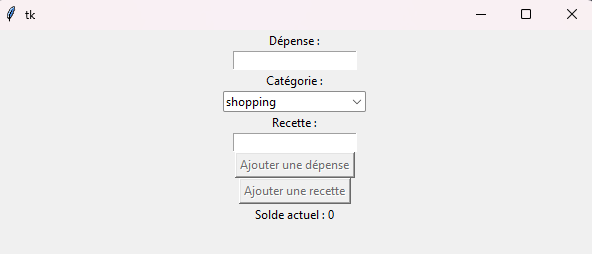
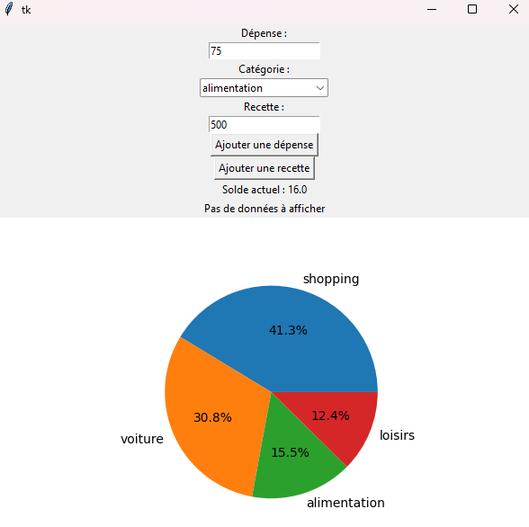

.. BudgetMonitor DOC documentation master file, created by
   sphinx-quickstart on Mon Feb 26 10:56:57 2024.
   You can adapt this file completely to your liking, but it should at least
   contain the root `toctree` directive.

=============================================
Welcome to BudgetMonitor DOC's !
=============================================

Introduction
============

BudgetMonitor est une petite application avec interface graphique développée en Python et utilisant un maximum de notions de programmation fonctionnelle.

Les technos utilisées sont :

- **Python** : Le langage de programmation utilisé

- **Tkinter** : Une bibliothèque standard de Python pour créer des interfaces graphiques utilisateur (GUI). Elle est utilisée dans **budgetUI.py** pour construire et gérer l'interface utilisateur de l'application.

- **Matplotlib** : Une bibliothèque de traçage en Python, utilisée conjointement avec Tkinter dans budgetUI.py pour générer des graphiques visuels des dépenses. Plus précisément, Figure et FigureCanvasTkAgg de Matplotlib sont utilisés pour intégrer les graphiques dans l'interface utilisateur Tkinter.

- **Concepts de programmation orientée objet (POO)** : Utilisés pour structurer votre application en classes et méthodes, facilitant ainsi l'organisation du code et la réutilisation des composants.

- **Programmation événementielle** : Principalement à travers l'utilisation de Tkinter, où les interactions de l'utilisateur avec l'interface graphique déclenchent des événements qui sont gérés par des fonctions ou des méthodes définies du script.

- **Fonctionnalités de programmation fonctionnelle** : Telles que l'utilisation de fonctions de haut niveau (comme sum), compréhensions de listes et de dictionnaires, illustrant l'utilisation de concepts de programmation fonctionnelle au sein d'un paradigme principalement orienté objet.

Fonctionnalités
===============

- **Entrer ses recettes**
- **Connaître ses dépenses**
- **Gérer son budget**

=====================
Développeurs
=====================

Cette section est faite pour pouvoir utiliser et modifier le code.

GIT
==================

.. note:: **REPO** : *https://github.com/spideystreet/BudgetMonitor*

Pour modifier le code :

1. Pull le main **(main)** (= récup les dernieres modifs)

.. code-block:: python

   git checkout origin main
   git pull

2. Créer une nouvelle branche
   
.. code-block:: python

   git checkout -b nom_de_ma_branche

3. Une fois les modifs finie dans la branche, poussez les modifs **dans la branche**

.. code-block:: python

   git commit -m "Détail sur les modifs"
   git push origin <nom_de_ma_branche>

.. important:: Ensuite on verra ensemble si on pousse la modif dans le main

4. Charger les dépendances

.. code-block:: python

   python -m venv venv   #Crée son env virtuel (si pas déjà fait)
   source venv/bin/activate   #Charge l'env virtuel
   pip install -r BudgetMonitor/requirements.txt   #Installe les dépendances dans l'environnement

Utilisation
==================

Cette section donnera les infos nécessaires pour utiliser BudgetMonitor.

- Lancement de l'app

.. code-block:: python

   python scripts/main.py

On peut ajouter deux choses : 

- Des recettes
- Des dépenses

Plusieurs catégories sont là pour définir les dépenses : 

- shopping
- voiture
- alimentation
- loisirs

Exemple : 500 de recette initiale et des dépenses aoutées à la main

Notions fonctionnelle
=====================

Plusieurs notions de programmation fonctionnelle sont utilisées ici. 
- En voici quelques unes :

1. Fonctions d'ordre supérieur :

- BudgetApp.py :

.. code-block:: python

      def calculer_total_par_categorie(self):
         return {categorie: sum(depenses) for categorie, depenses in self.categories.items()}

2. Immutabilité :

- budgetApp.py :

.. code-block:: python

      self.depense_var.trace("w", self.check_fields)

1. Fonctions comme des citoyens de premiere classe :

- budgetUI.py :
  
.. code-block:: python

      def calculer_solde(self):
         total_depenses = sum(sum(depenses) for depenses in self.categories.values())
         total_recettes = sum(self.recettes)
            return total_recettes - total_depenses

Indices and tables
==================

* :ref:`genindex`
* :ref:`modindex`
* :ref:`search`
